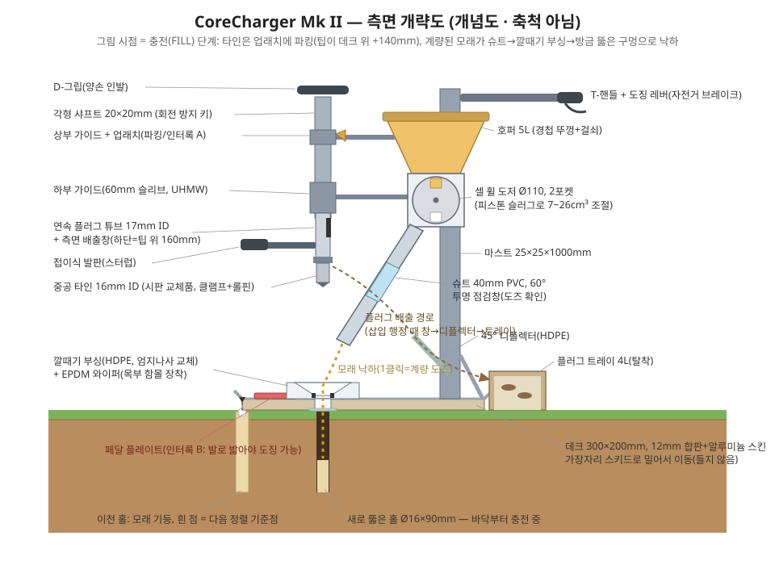
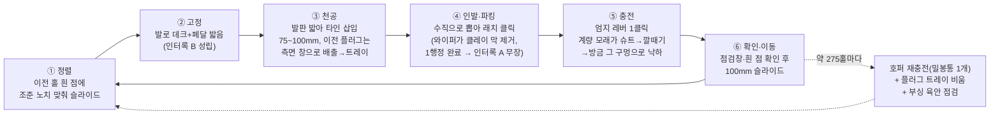
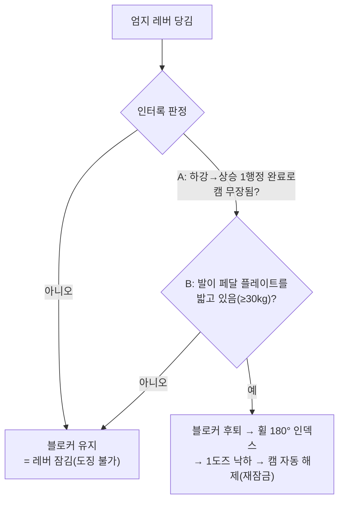

# 코어 에어레이션 + 정밀 백필 일체형 기구 설계서

## "CoreCharger Mk II (Deck-Dock)" — 발로 고정하는 동축(同軸) 코어링·충전 스테이션

> **문제**: 클레이(점토) 토양 잔디는 압밀되면 코어 에어레이션(속이 빈 타인으로 흙기둥을 뽑아내는 작업)이 필수인데, 뚫린 구멍을 통기성 재료로 채우지 않으면 4~8주 안에 도로 닫혀 효과가 사라진다. 그런데 모래를 뿌려서 채우는 방식은 대부분 잔디 잎에 걸려 구멍에 들어가지 않는다(정확성 문제).
>
> **해결 원리 — "조준이 아니라 구조로 명중"**: 구멍을 뚫을 때 타인이 통과한 **바로 그 데크 부싱 구멍**을 통해서만 모래가 나갈 수 있게 만들고, 한 사이클 동안 **발로 데크를 밟아** 축이 절대 움직이지 못하게 한다. 충전 정확도가 사용자의 손끝이 아니라 기하 구조로 보장된다. 목표 명중률 ≥90%, 기대치 ~95% 이상.
>
> **1홀 사이클(4~6초)**: 밀어서 정렬 → 발로 데크 고정 → 발판을 밟아 타인 삽입(깊이 75~100mm) → 위로 뽑아 래치에 파킹 → 엄지 레버 1클릭 = 계량된 모래(예: 19cm³)가 같은 축으로 낙하 → 옆으로 100mm 밀고 반복.
>
> **제작**: 볼트 조립 위주 DIY(용접 선택), 재료비 약 25~35만 원($200~270), 주말 2회 분량. 처리 속도 분당 10~15홀.

---

## 목차

1. [배경 원리 — 왜 "뽑고 나서 정확히 채우기"인가](#1-배경-원리)
2. [충전재 사양 — 가는 모래의 함정](#2-충전재-사양)
3. [설계 대안 4종 비교와 선정 과정](#3-설계-대안-비교와-선정)
4. [최종 설계 개요](#4-최종-설계-개요)
5. [작동 사이클 상세](#5-작동-사이클-상세)
6. [서브시스템 상세 설계](#6-서브시스템-상세-설계)
7. [주요 치수표](#7-주요-치수표)
8. [자재 명세(BOM)](#8-자재-명세bom)
9. [제작 순서](#9-제작-순서)
10. [검증 시험 계획](#10-검증-시험-계획)
11. [사용 가이드](#11-사용-가이드)
12. [고장 모드와 대책](#12-고장-모드와-대책)
13. [설계 검증(레드팀)에서 수정된 사항](#13-설계-검증에서-수정된-사항)
14. [한계와 향후 확장](#14-한계와-향후-확장)
- [부록 A: 도즈 조견표](#부록-a-도즈-조견표) / [부록 B: 세션 체크리스트](#부록-b-세션-체크리스트)

---

## 1. 배경 원리

설계에 앞서, 이 기구가 지켜야 할 토양학적 사실들이다. 기구의 형상 대부분이 여기서 결정된다.

**압밀 클레이에서 무슨 일이 일어나는가.** 압밀은 토양의 매크로포어(>75µm 대공극)를 파괴한다. 전체 공극률은 40~50%로 남아 있어도 뿌리가 호흡에 필요로 하는 공기 공극(체적비 ~10%)이 사라지고, 관입 저항이 2MPa를 넘으면 뿌리 성장이 사실상 멈춘다. **속이 빈 타인으로 흙을 "제거"하는 코어링**은 주변 토양이 빈 공간으로 이완되게 하면서 수직 대공극 통로를 만드는, 흙을 빼내는 유일한 일반적 경운법이다. (스파이크식은 오히려 구멍 벽을 다져 역효과.)

**한 번에 처리되는 면적은 아주 작다.** 16mm 타인을 10cm 간격 격자로 박아도 표면의 약 2.0%만 건드린다(15cm 간격이면 0.9%). 골프장 업계 기준은 "연간 표면적 15~20% 처리"이므로, 압밀 클레이 복원은 **여러 해에 걸친 프로그램**이다. 그래서 구멍 하나하나가 오래 유지되는 것(=채우는 것)이 단일 세션의 규모보다 중요하다.

**채우지 않은 구멍 vs 채운 구멍.**
- 채우지 않은 구멍: 클레이가 무너져 내리고, 흙이 씻겨 들어가고, 밟히고 깎이며 **4~8주 안에 대부분 닫힌다.**
- 균일한 굵은 모래로 지표 근처까지 채운 구멍: **재압밀될 수 없는 단단한 우회 배수·통기 기둥**으로 수년간 유지되고, 뿌리가 우선적으로 타고 내려가며, 매년 반복하면 개량된 표층이 누적된다. 클레이 기반 골프 그린에 쓰이는 다년간 Drill & Fill 프로그램(Ø25mm, 15cm 간격, 매년 반복)이 실증 사례다.
- 충전 높이는 **지표 아래 0~10mm**가 정답이다. 지표 위로 솟으면 잔디깎이 날이 갈리고, 너무 깊으면 잔디와 흙이 기둥 위를 덮어 막아 버린다.

**수분 창(moisture window)은 시스템의 일부다.** 클레이 코어링은 포장용수량 부근(비/관수 25mm 후 1~2일)에서만 제대로 된다.
- 너무 젖음(소성 상태): 타인이 구멍 벽을 이겨 발라 **유약칠(glazing)한 저투수 피막**을 만든다. → 판별: 흙을 3mm 국수 가락으로 굴렸을 때 반들반들 이어지면 불가, 갈라지고 부스러지면 적기.
- 너무 마름: 체중으로 관입 불가. → 판별: 드라이버를 손힘으로 50mm 못 박으면 불가.
- 이 기구는 젖은 날엔 플러그가 들러붙고 마른 날엔 안 박히도록 되어 있어 **나쁜 날을 스스로 거부**한다. 마른 날을 위해 별도의 오거(드릴) 모드를 둔다(§6.9).

**필요 물량(호퍼와 물류를 결정).** 10cm 격자 = 100홀/m² → 충전재 1.0~2.8L/m²(건조 모래 1.6~4.5kg/m²). 뽑혀 나오는 클레이 플러그도 같은 부피만큼 나오며 **잔디밭 밖으로 반출**해야 한다(잔디 위에서 마르며 부서진 젖은 클레이를 깎으면 도로 발라진다). 플러그 회수가 작업의 절반이다.

**구멍 규격 권장(압밀 클레이 복원 프로그램).**

| 항목 | 권장값 | 근거 |
|---|---|---|
| 직경 | 16~19mm | 13mm 미만은 채우기 어렵고 빨리 닫힘; 클수록 충전 신뢰도·유지력↑ |
| 깊이 | 75~100mm | 주택 잔디 압밀은 상부 50~75mm에 집중 — 그 아래까지 관통 |
| 간격 | 복원기 10cm 격자, 유지기 15cm | 연 2회×2% ≈ 4%/년 → 다년 누적 |
| 깊이 변화 | 세션마다 ±10~20mm | 같은 깊이만 반복하면 그 깊이에 "경운 팬"(다져진 층)이 생김 |
| 시기 | 한지형: 초가을 주+봄 보조 / 난지형(들잔디 등): 늦봄~초여름 1~2회 | 회복 성장기 |

---

## 2. 충전재 사양

**핵심: 아무 모래나 쓰면 안 된다. "가는 모래 + 클레이"는 상황을 악화시킨다.**

- **모래-클레이 어도비 함정**: 모래를 클레이에 섞으면 모래 비율이 체적비 ~70~80%를 넘기 전까지는 클레이·실트가 모래알 사이 공극을 메워 **양쪽 어느 재료보다도 더 조밀하게** 다져진다(흙벽돌·모래점토 도로 기층과 같은 원리). 그래서 "통기성 좋은 혼합토"라며 모래 함량이 어중간한 제품은 금물이고, 뽑아낸 클레이를 도로 섞는 것도 금물이다.
- **가는 모래의 모세관 함정**: 0.25mm 이하 가는 모래는 공기 진입 흡인력이 40~80cm 수두라, 100mm 깊이 기둥 전체가 모세관수로 **늘 포화 상태**로 남고 미세립이 클레이 쪽으로 이동한다. 굵은 모래(0.5~2mm, 공기 진입 10~20cm)는 폭우 후에도 몇 시간이면 상부가 배수·통기된다. (구멍 바닥은 클레이라 일시적으로 물이 고이는 "미니 저수조" 거동은 정상이며 그래도 이득이다.)

### 표준 배합(기본값 — 배수 우선, 계량 가능)

> **세척·건조(kiln-dried) 각형~아각형 규사 100%, 입경 0.5~2.0mm(0.5~1.2mm 구간이 75% 이상), 0.25mm 통과분 2% 미만, 2.36mm 잔류분 0%, 사용 시점 함수율 0.5% 미만.**

- **현장 합격 시험**: 깔때기 15mm 구멍으로 막힘 없이 줄줄 흘러야 한다. 머뭇거리면 습하거나 너무 가늘다 → 계량기에 넣지 말 것.
- **조달**: ① 최선 — 건조 포장 수영장/정수 여과사 굵은 등급(0.8~1.2mm "여과 자갈/#16"가 이상적, #20 여과사 0.45~0.55mm가 허용 하한). ② 차선 — 콘크리트용 모래(주문진사 등)를 방수포에서 건조 후 **2mm 체 통과 + 0.5mm 체 잔류**로 2단 체질(수율 50~60%, 100kg당 반나절 예상).
- **금지**: 놀이터 모래·미장 모래·줄눈 모래(모두 세립 위주), "부엽토 배합토", 모래 70~80% 미만의 모든 혼합물, 뽑아낸 클레이 재사용.
- **선택 배합(보수력·양분 완충 추가)**: 위 모래 85~90% + 1~2mm로 체질한 **제올라이트(클리놉틸로라이트) 또는 소성점토(Turface류) 10~15%**(단단한 다공 입자라 계량 휠에서도 잘 흐름). 사용 전 20도즈 벤치 흐름 시험 필수. 80:20 모래:건조 체질 퇴비(<3mm)도 농학적으론 좋으나 계량기에서 한계 — 막히면 순수 모래 또는 부록의 평면 계량 트레이로 전환.
- **투입량**: 홀 부피의 **105~110%**(건조 모래는 첫 관수에서 5~10% 침하), 지표 아래 0~10mm 목표. 세션 후 10mm 관수 → 낮아진 구멍만 보충 패스.
- **물량 계획**: 1.6~4.5kg/m²/세션(16mm 타인·10cm 격자 기준 ~2.9kg/m²). 300m² 잔디 복원 프로그램은 연 500~900kg — **프로그램의 지배 비용은 기구가 아니라 모래**이므로, 제작 전에 지역의 건조 굵은 모래 조달처부터 확인할 것.

---

## 3. 설계 대안 비교와 선정

같은 요구 조건으로 서로 다른 접근의 개념 4종을 독립적으로 설계하고, 세 가지 관점(토양·잔디 농학 / 기계공학·제작성·신뢰성 / 사용자 인체공학·지속 사용성)에서 각각 6개 항목(농학 효과, 명중 정밀도, 제작 가능성, 사용 노력, 비용, 신뢰성)을 채점했다.

| 개념 | 방식 요약 | 사이클 | 재료비 | 강점 | 약점 | 종합점수* |
|---|---|---|---|---|---|---|
| **CoreCharger** (선정) | 발로 밟아 고정한 데크의 부싱을 타인 가이드 겸 모래 깔때기로 공용 — 한 자리에서 뚫고 바로 채움 | 10~15홀/분 | ~$180 | 기하 구조로 명중 보장, 최경량(7kg)·최저가·준비 제로, 3년 뒤에도 꺼내 쓸 도구 | 단축(單軸)이라 갱 타인 증설 불가, 모래 물류가 큼 | **134** |
| GridDock 12 | 12홀 템플릿 플레이트로 뚫고(1패스), 같은 플레이트에 도킹하는 계량 보드로 일괄 충전(2패스) | 5~6홀/분 | ~$210 | 명중 95~98% 구조 보장, 개방형 계량이라 막힘 원리적 불가, 재정렬 불필요 | 속도 절반, 장비 3점 운반, 평탄한 잔디 필요 | 133 |
| TDF-19 Turret Bore | 충전식 드릴+19mm 오거로 천공, 스윙 터릿의 깔때기 노즈를 구멍에 꽂고 도징 | 6~9홀/분 | ~$200 | 플러그 걸림 원리적 제거, 가장 넓은 수분 창, 체력 부담 최소 | 회전 절삭이라 벽면 유약칠↑, 속도 낮음, 터릿 복잡 | 131 |
| PitchLock Tandem | 디텐트 휠 카트: 앞 스테이션이 N번 구멍을 뚫는 동안 뒤 스테이션이 N-3번 구멍에 충전 | 20~25홀/분 | ~$260 | 한 스트로크에 천공+충전, 최고 속도 | 부품 최다·직선 주행 전제·열 끝 처리 규율 필요 | 119 |

\* 3개 관점 × 60점 만점 합산. 관점별 1위가 갈렸다: 농학·사용자 관점은 CoreCharger, 기계공학 관점은 GridDock("매 사이클 작동해야 하는 메커니즘이 가장 적다")를 1위로 꼽았다.

**선정 논리**: CoreCharger가 근소하게 종합 1위이고, 기계공학 심사가 지적한 약점들(도징 오발 가능성, 클레이·모래 공용 표면, 배출창 막힘)이 모두 **탈락안의 메커니즘을 이식(graft)해서 해결 가능**했다. 최종 설계에 이식된 항목:

1. **기계식 도징 인터록**(PitchLock의 인터록 철학 + TDF-19의 블로커 구현) — 타인이 파킹되고 발이 데크를 밟고 있지 않으면 레버가 물리적으로 잠김.
2. **투명 슈트 점검창**(TDF-19) — 매 클릭 도즈 낙하를 눈으로 확인, 이상을 N번째 홀에서 즉시 발견.
3. **EPDM 탄성 와이퍼**(PitchLock의 스노트 와이퍼) — 부싱 도달 전에 타인 외면의 젖은 클레이 막을 벗겨냄.
4. **열 시작 아웃리거 인덱스**(GridDock/PitchLock) — 흰 점 기준점이 없는 새 열의 첫 홀 정렬.
5. **밀봉 광구 모래통 물류**(GridDock) — 건조 모래가 붓는 순간까지 밀봉 유지.
6. **연장 하부 가이드 슬리브**(GridDock) — 전 행정 수직도 강제로 벽면 뭉갬 방지.
7. **드롭인 오거 모드**(TDF-19) — 마른 날용 대체 천공 수단, 동일 데크·부싱·계량기 사용.

이후 별도 레드팀 검증에서 발견된 기하 모순 3건과 주요 결함들을 수정 반영했다(§13).

---

## 4. 최종 설계 개요

**구성**: 300×200mm 접지 데크(발로 밟아 고정, 스키드로 밀어 이동) + 데크의 교체형 HDPE **깔때기 부싱**(타인 가이드 겸 모래 깔때기 — 이 부품이 설계의 심장) + 1m 마스트에 달린 5L 호퍼·셀 휠 계량기·60° 슈트 + 각형 샤프트에 물린 시판 중공 타인 + 플러그 디플렉터/트레이.

### 핵심 사양

| 항목 | 값 |
|---|---|
| 홀 규격 | Ø16mm(13/19 교체 가능) × 깊이 75/85/95/100mm(칼라 인덱스) |
| 격자 간격 | 100mm(복원) / 150mm(유지) — 조준 노치 선택 |
| 도즈 | 7~26cm³ 무단 조절(피스톤 슬러그), 반복 정밀도 ±5~10%, 24cm³ 초과 홀은 2클릭 표준 |
| 명중률 | ≥90% 요구 → 구조상 ~95%+ (검증 시험 §10-3) |
| 처리 속도 | 지속 10~15홀/분 (40m²·150mm 격자 ≈ 1,780홀 ≈ 2~3시간) |
| 호퍼 | 5L(모래 ~8kg, 18cm³ 도즈 기준 ~275클릭) |
| 중량 | 공차 ~7.5kg / 만충 ~15.5kg — 들지 않고 스키드로 밀어 이동 |
| 안전 인터록 | 사이클 기반: "타인 1행정 완료" AND "발이 페달 위" 아니면 도징 물리적 불가 |
| 재료비 | 약 $200~270(오거 키트 포함) + 소모품 모래 |
| 제작 | 드릴·그라인더·홀쏘·탭다이, 볼트 조립(용접 선택), 주말 2회 |

---

## 5. 작동 사이클 상세

| 단계 | 시간 | 동작 | 설계가 보장하는 것 |
|---|---|---|---|
| ① 정렬 | 0.8~1.2s | 스키드 위에서 밀어 데크 앞단 조준 노치를 이전 홀의 흰 모래 점에 맞춤(노치~타인축 = 100mm, 보조 노치 150mm). 열 시작은 아웃리거 컵 풋을 옆 열 마지막 홀 점 위에 올려 정렬 | 격자 간격이 도구 형상으로 고정 — 눈대중 아님 |
| ② 고정 | 0.3s | 한 발을 데크 위 **페달 플레이트**에 올림 | 프레임 고정 + 인터록 B 성립 + 프레스 링이 잔디 칼라를 다림질 |
| ③ 천공 | 0.8s | 다른 발로 샤프트의 발판(스터럽)을 밟아 각형 샤프트가 가이드·부싱을 타고 활강, 타인이 75~100mm 관입(체중 300~600N, 회전 0). 이 행정에서 보어 안의 **이전 플러그**가 밀려 올라가 측면 창(지면 위 ~60mm)으로 배출 → 45° 디플렉터 → 트레이 | 각형 키가 회전을 물리적으로 금지(벽면 뭉갬 방지); 플러그는 매 행정 강제 배출 |
| ④ 인발·파킹 | 0.7s | D-그립을 양손으로 수직으로 당겨 판스프링 래치에 "클릭" — 타인 팁이 데크 위 +140mm에 파킹. 올라오며 EPDM 와이퍼→부싱 립 2단으로 외면 클레이 제거. **완전한 하강-상승 1행정이 캠을 무장**(인터록 A) | 데크가 잔디를 눌러 플러그가 깨끗이 절단되고 구멍 입구가 열린 채 유지 |
| ⑤ 충전 | 0.4s(겹침) | T-핸들의 브레이크 레버를 엄지로 1클릭 → 폴이 계량 휠을 정확히 180° 인덱스 → 포켓 1개 분량이 60° 슈트로 낙하 → 파킹된 타인 밑을 지나 70mm 깔때기 입으로 수렴 → 20mm 보어 → 16mm 구멍에 바닥부터 충전 | 모래의 유일한 출구 = 구멍을 뚫은 그 보어. 레버는 A·B 동시 성립 시에만 풀리고 1클릭 후 자동 재잠금(이중 투하 방지) |
| ⑥ 확인·이동 | 1.0~1.5s | 투명 점검창(도즈 낙하)·깔때기 목의 흰 점(충전 완료) 확인 → 뒤꿈치 들고 100mm 슬라이드 | 이상(브리징·짧은 도즈·부싱 오염)을 그 자리에서 발견 |

- **재보급 정지(약 275홀 / 18~25분마다)**: 밀봉 10L 통 1개를 호퍼에 붓고 즉시 뚜껑 걸쇠, 플러그 트레이를 캐디 통에 비움, 부싱 보어 육안 점검(클레이 막 보이면 예비 부싱으로 2분 교체).
- **열 전환**: 열 끝에서 빠져나와 180° 회전, 아웃리거를 내려 방금 끝낸 열의 마지막 홀에 정렬, 새 열 시작.
- **세션 종료**: 클리어링 로드로 보어에 남은 플러그 1~2개 배출 → 계량기 아래 쿼터턴 도어로 모래 경로 전량 회수 → 와이퍼·부싱 청소 → 10mm 관수 → 낮은 구멍 보충 패스.

---

## 6. 서브시스템 상세 설계

### 6.1 코어링 타인 + 연속 플러그 튜브

**기능**: 회전 없는 순수 압입-인발로 젖은 클레이에서 깨끗한 Ø16×75~100mm 플러그를 절단하고, 매 사이클 플러그를 확실히 배출한다.

- **절삭날은 만들지 않고 산다**: 시판 그린용 교체 타인(JRM/Ryan 계열 호환품) 5/8인치(ID 16mm), 경화강, 벽두께 ~1.2mm, 릴리프 연마날, 날 바로 뒤에서 내경이 +1mm 넓어져 플러그를 날끝에서만 잡는 형상. **반드시 직선 생크(스트레이트 섕크/유니버설 마운트) 패턴으로 주문**(테이퍼 생크는 DIY 클램프에 부적합).
- **연속 플러그 튜브(§13 수정 반영)**: 각형 샤프트의 17×17mm 각진 내강으로는 젖은 클레이 원기둥이 통과하지 못하므로, 플러그 경로는 **ID 17mm / OD 20mm 심리스 강관 200mm**가 전담한다. 시판 타인을 이 관 하단에 클램프+Ø4mm 롤핀으로 고정하되 **내경 단차가 위로 갈수록 절대 좁아지지 않게** 내부 챔퍼 가공으로 매끈하게 잇는다. 이 원형 관을 20×20×1.5mm 각관 샤프트 하단 옆에 클램프 — 각관은 회전 방지 키와 래치 노치만 담당하고 **플러그는 각관에 절대 들어가지 않는다.**
- **측면 배출창**: 20×45mm, 후방(마스트 쪽) 향. **창 하단 = 팁 위 160mm**(= 최대 관입 100mm + 데크 스택 높이 ~45mm + 여유 15mm). 최대 깊이에서 플러그가 지면 위 약 55~60mm에서 튀어나와 디플렉터에 맞는다. 관 안에 플러그 1개만 머무는 "1플러그 매거진". 75mm 깊이 전용으로 쓸 경우에만 135mm 위치의 예비 구멍 사용 가능.
- **깊이 조절**: 25×5mm 평철 칼라를 샤프트의 10mm 피치 인덱스 구멍 4개(75/85/95/100mm)에 볼트 고정. **깊이 기준면은 부싱 키퍼 링 상면**이며 그 위에 충격을 받는 2mm 스테인리스 마모 와셔를 덮는다(§13). 매설물 안전상 100mm가 절대 상한.
- **발판(스터럽)**: 25×5 평철 120mm 폭, 고무 테이프, 샤프트 350~480mm 높이에 사용자 다리 길이에 맞춰 볼트 고정, 슈트 반대편(전방)으로 접힘.
- **막힘 해제**: 샤프트 상단 개방 — 마스트에 클립된 Ø12×400mm 강봉을 위에서 밀어 30초 내 해제, 분해 불필요.
- **체격별 사이징(§13)**: 관입력은 날 단면 저항(2~3MPa × ~68mm² ≈ 140~200N) + 외면 부착(~130~260N) + 내부 마찰로 **총 350~700N**에 이를 수 있다. 체중 ~70kg 미만 사용자는 기본을 13mm 타인 또는 75~85mm 깊이로 잡을 것(날 면적·부착력이 대략 절반). 단단한 지점을 위한 선택 사양: 샤프트에 끼우는 슬라이드 해머 칼라(+스톱 링 2개, ~$8). 인발력은 100~300N이 반복되므로 **양손 D-그립 + 데크 밟은 발 반력**이 표준 자세다.

### 6.2 데크 + 깔때기 부싱 + 와이퍼 + 프레스 링 (설계의 심장)

**기능**: 단 하나의 기준 축 — 천공 시 타인 가이드, 인발 시 잔디 누름, 타인 청소, 그리고 모래가 반드시 통과해야 하는 깔때기. "구조에 의한 명중"이 이 부품에서 나온다.

- **데크**: 300×200mm, 12mm 자작 합판 + 1.5mm 알루미늄 스킨, 가장자리 15mm 접어 올린 스키드(끌고 다니고 절대 들지 않음). 작업 포트는 앞단에서 100mm. 뒤쪽에 플러그 슈트 컷아웃 + 4L 트레이 클립 2개. 앞단 립에 조준 노치 2개(100/150mm).
- **부싱**: 20mm HDPE(도마 소재) 기계가공, Ø90mm 플랜지, **보어 Ø20.0mm**, 상면에 Ø70mm·70° 깔때기 카운터싱크. M6 엄지나사 1개 + T너트로 고정 — 오염 시 2분 교체(예비 2개가 마스트 주머니에 상시 탑재).
- **와이퍼 스택 순서(§13 수정 — 명시적 단면)**: 위에서 아래로 ① Ø70mm 깔때기 상면(개방 — 모래 스트림이 착지하는 면) → ② 깔때기 **목부에 함몰 장착**된 Ø19mm EPDM 와이퍼(두께 3~4mm 슬롯형 키퍼, 깔때기 표면 아래로 숨음, 방사상 배출 슬롯 3개) → ③ Ø20.0mm 보어. 와이퍼가 벗겨낸 클레이 부스러기(행정당 밀리그램 수준)는 모래보다 먼저 구멍에 떨어진다 — 무해. 재보급 정지 때마다 목부를 손가락으로 훑어 점검.
- **프레스 링**: 보어 아래 데크 저면에 Ø30mm 스테인리스 링이 2mm 돌출 — 발로 밟는 순간 잔디 칼라를 평평하게 다려 모래알이 잎에 걸리지 않고 구멍으로 들어가게 함.
- **데크 스택 높이(기준 치수)**: 지면→합판 12→Al 스킨 1.5→부싱 플랜지 20→키퍼+와셔 ≈ **지면 위 40~45mm**. §6.1의 배출창 높이와 깊이 기준면이 모두 이 값에서 유도된다.
- **오거 모드 어댑터**: 부싱 카운터싱크에 쿼터턴 바요넷으로 꽂는 UHMW 인서트(보어 21.2mm, 상단 와이퍼 립 일체).

### 6.3 마스트 · 샤프트 가이드 · 업래치

- **마스트**: 25×25×2mm 각관 1,000mm, 작업축 뒤 150mm 위치에 앵글 브래킷 2개 + 25×3 대각 브레이스로 데크에 볼트 고정(전부 M8, 무용접).
- **가이드**: 30×30×2 각관 토막을 UHMW 테이프로 내면 라이닝해 20×20 샤프트에 미끄럼 끼워맞춤. 상부 30mm, **하부는 60mm 슬리브**(GridDock 이식) — 하부 슬리브 + 데크 부싱이 260mm 전 행정에서 수직도를 강제해 흔들림에 의한 벽면 뭉갬을 없앤다. 간격 150mm.
- **업래치**: 1mm 스프링강 판스프링이 샤프트 노치에 스냅 — 타인 팁을 데크 위 +140mm에 파킹. 엄지로 눌러 해제. 래치 암이 인터록 신호 A의 접점을 겸한다.
- **T-핸들**: Ø22 파이프 400mm, 높이 950mm, 자전거 그립 + 도징용 브레이크 레버.

### 6.4 호퍼 + 셀 휠 계량기 + 사이클 기반 인터록

**기능**: 건조 모래 ~5L을 담고, 클릭당 7~26cm³를 ±5~10%로 반복 투하하며, 브리징을 스스로 부수고, **완성된 구멍 위가 아니면 물리적으로 발사되지 않는다.**

- **호퍼**: 5L HDPE 제리캔 개조, 전 벽면 수평 대비 ≥60°, 상부 150mm 개구에 경첩+걸쇠 뚜껑(이슬 차단), 목부 60×80mm.
- **계량 휠(§13 수정 반영)**: **Ø110mm** × 폭 80mm HDPE(도마 원판 적층 접착 후 드릴프레스 선회 가공), M10 축 + 나일론 플랜지 부싱, 12mm HDPE 측판(치크 플레이트) 사이 장착. 대각 방향 반경 포켓 2개 Ø34mm × 깊이 최대 40mm — Ø110이면 포켓끼리·축과 간섭 없이 15~20mm 웹이 남는다.
- **피스톤형 깊이 슬러그(§13 수정 반영)**: 포켓 바닥은 **Ø33.5~33.8mm HDPE 피스톤 디스크**(34mm 보어에 미끄럼 끼워맞춤)가 막고, 디스크의 M16 스템이 고정 바닥 플러그의 탭 구멍을 관통해 휠 뒷면에서 로크너트로 고정 — 스템을 돌려 포켓 깊이 8~28mm = **도즈 7~26cm³** 조절. 계량면은 피스톤 면이며 모래가 나사부로 새지 않는다.
- **인덱싱**: 브레이크 레버 → 케이블 → 폴 암(25×5 평철)이 축의 2치 래칫 플레이트를 침. 스로우는 잼너트 하드스톱 2개로 정확히 180°, 스프링 볼 디텐트로 착좌. 목부 출구의 나일론 브러시 스트립이 포켓을 평평하게 훑어 **도즈가 호퍼 잔량(수두)과 무관**해짐. 휠 회전 자체가 목부 교반기 — 사이클당 1회 브리지를 전단(연속 진동은 오히려 다짐 유발이므로 배제).
- **사이클 기반 인터록(§13 수정 반영)**: 3mm 강판 블로커가 폴 경로를 막고 있다가 두 조건이 **동시에** 성립할 때만 물러난다.
  - **A(1행정 무장 캠)**: 샤프트의 소형 캠이 "완전한 하강→상승" 1행정을 마쳐야 폴을 무장시키고, 1클릭 도징이 스로우 끝에서 캠을 자동 해제 — 구멍 하나당 정확히 1도즈(이중 투하·헛도징 원천 차단).
  - **B(페달 플레이트)**: 데크 **상면**의 스프링 페달 플레이트를 발이 직접 밟아야 성립(작동 하중 ~30kg — 기구 자중 15.5kg이나 지면 반력으로는 절대 성립 불가).
  - 어느 하나라도 빠지면 레버는 단단한 벽을 당기는 느낌 — "인터록이 잠겼다 = 상태가 틀렸다"는 촉각 신호.

- **클리어아웃**: 계량기 최하점의 쿼터턴 도어(PVC 캡+바요넷 링) — 이슬비가 오면 10초 만에 모래 경로 전량을 통에 회수, 공구 불필요.
- **마모 관리**: 치크 플레이트는 의도된 소모품 — 장공 마운트로 마모 시 안쪽으로 심 조정, 연 1회 교체($3).

### 6.5 슈트(투하관) + 평면 배치

- 40mm ID PVC 500mm, **일직선 60°**, 상단은 계량기 출구 소켓, 하단은 복합 각도로 절단해 데크 위 70mm에서 Ø70 깔때기를 조준. 낙하 스트림은 깔때기 안 ~25mm 타원에 착지. 모래 경로 최소 구경 = 부싱 보어 20mm(최대 입경 1.2mm의 ≥16배 — 구경 막힘 위험 없음).
- **투명 점검창**: 중간에 50mm 투명 PVC/폴리카보네이트 구간 — 매 클릭 낙하를 눈으로 확인.
- **평면 배치(§13 수정 — 간섭 방지)**: 슈트는 마스트 옆면을 30~40° 돌아 내려오며 **출구 중심선을 타인축에서 측방 25~30mm 오프셋**(하강하는 샤프트와 절대 간섭하지 않되 스트림은 Ø70 깔때기 안에 착지 — 제작 9단계의 낙하 시험으로 벤치 검증). 타인 배출창·디플렉터는 마스트 중심선의 **반대편**, 스터럽은 슈트 없는 쪽으로 접힘. 조립 시 스터럽 편 상태로 전 행정 사이클을 돌려 간섭 제로 확인 후 슈트 스트랩을 조인다.

### 6.6 플러그 배출 · 디플렉터 · 회수

- 매 삽입 행정마다 보어의 플러그 열이 한 플러그 길이만큼 전진 — 이전 플러그가 후방 창(지면 위 ~55~60mm)으로 나와 마스트의 100×120mm HDPE **45° 디플렉터**(장공으로 조준 조절, 데크 위 30~170mm 스팬)에 맞고 미끄러져 데크 뒤 컷아웃으로 **4L 클립온 트레이**에 낙하. 기대 회수율 80~90% — 빗나간 것은 일반 에어레이션 부스러기처럼 세션 끝에 갈퀴질(깎기 전에!).
- 클레이 접촉면은 전부 ≥45° 경사의 HDPE 또는 연마 알루미늄 — 턱과 선반 금지.
- 트레이는 재보급 정지마다 캐디의 25L 뚜껑 통에 비우고, **클레이는 잔디밭 밖으로 반출**.

### 6.7 그리드 인덱싱

- **열 중간**: 앞단 조준 노치를 이전 홀의 흰 모래 점(충전재가 곧 기준점!)에 맞춤 — 피치 100/150mm 노치 선택.
- **열 시작(§13 수정)**: 접이식 아웃리거 암(25×5 평철, 100/150mm 2단) 끝의 **Ø15~20mm 오목 컵 풋**을 옆 열 마지막 홀의 흰 점 위에 시각적으로 얹어 정렬 — (핀을 꽂는 방식은 방금 채운 모래 기둥을 헤집으므로 배제). 정렬 후 접어 올리고 점 따라 진행.
- **깊이 프로그램**: 세션마다 깊이 칼라를 10mm 인덱스 1칸 이동(예: 가을 95 → 봄 80) — 일정 깊이 반복으로 생기는 경운 팬 방지. 기록 필수.
- 격자 흐트러짐은 농학적으로 무해(간격 허용오차 큼) — 미관 문제일 뿐.

### 6.8 모래·플러그 물류(캐디)

- 2륜 정원 카트에 적재: **밀봉 광구 10L HDPE 통 3개**(각 ~16kg, 붓는 순간에만 개봉 — 이슬비로 세션이 끊겨도 시스템에 젖은 모래가 남지 않음), 플러그용 25L 뚜껑 통, 예비 부싱·타인 파우치, 교정 계량컵·깔때기.
- **재보급 산수(§13 수정 — 명시)**: 캐디 1회 적재 48kg ≈ 18cm³ 도즈 약 1,600홀분. 40m²·100mm 격자 세션(4,000홀, 모래 72~115kg)은 **캐디 재적재 1~2회**가 필요하다 — 모래 야적지를 작업 구역 가까이 둘 것. 150mm 격자(1,780홀)는 1적재로 충분.

### 6.9 오거 모드(마른 날 대체 천공)

- 스크류드라이버 시험 실패(체중 관입 불가)인 날: 린치핀 2개로 타인 샤프트를 들어내고(래치 접점은 키퍼 클립으로 우회), UHMW 가이드 인서트(보어 21.2mm)를 부싱에 바요넷 장착, 사용자의 18V 드릴 + **리드 스크류를 갈아낸 19mm 십오거**(350mm)를 꽂아 300~600RPM으로 테이프 깊이 표시까지 천공, 회전 상태로 후퇴. 인서트 립이 날개의 흙을 훑고, 부스러기는 트레이로 쓸어 담는다. 인서트를 뽑고 평소처럼 충전(도징은 페달 인터록 유지).
- **도즈 보정(§13 수정)**: Ø~20mm 구멍은 16mm 구멍의 1.56배 부피 — **+50~60% 또는 "16mm 세팅으로 2클릭"이 표준**(20×100mm ≈ 31.4cm³ > 포켓 최대 26cm³이므로 2클릭 필수).
- 속도 6~9홀/분. 회전 절삭은 벽면 유약칠이 타인보다 심하므로 **수분 창의 마른 쪽에서만** 사용(젖은 날 회전은 최악). 모래 기둥이 수 개월 내 유약층을 균열시키는 것이 장기 보정 수단이며, 세션 간 천공 방식이 바뀌는 것 자체가 경운 팬 방지에 추가로 유리하다.

---

## 7. 주요 치수표

| 부위 | 치수 |
|---|---|
| 타인 | ID 16mm(날), 벽 1.2mm, OD ~18.5mm, 경화강, 직선 생크, 날 뒤 내경 +1mm 릴리프 |
| 플러그 튜브 | ID 17 / OD 20mm 심리스 강관 × 200mm; 측면 창 20×45mm, **하단 = 팁 위 160mm**, 후방 향 |
| 관입 깊이 | 75/85/95/100mm(10mm 피치 인덱스 4개), 절대 상한 100mm, 기준면 = 키퍼 링 상면 + 2mm SUS 와셔 |
| 샤프트 | 20×20×1.5 각관 × 900mm, 행정 260mm, 가이드 간격 150mm(하부 60mm 슬리브), 파킹 팁 높이 +140mm |
| 데크 | 300×200×12 합판 + 1.5 Al, 스키드 립 15mm, 작업 포트 앞단 100mm, **데크 스택 높이 지면 위 40~45mm** |
| 부싱 | HDPE, 보어 Ø20.0, 깔때기 Ø70×70°, 플랜지 Ø90, 엄지나사 1개 고정; 목부 EPDM 와이퍼 Ø19(함몰, 배출 슬롯 3) |
| 프레스 링 | Ø30 SUS, 데크 저면 2mm 돌출 |
| 마스트 | 25×25×2 × 1,000mm, 축 뒤 150mm; T-핸들 400mm @950mm |
| 계량 휠 | **Ø110** × 80mm HDPE, 포켓 Ø34×≤40mm ×2(180°), 피스톤 슬러그 Ø33.5~33.8 + M16 스템, 도즈 7~26cm³ |
| 인덱스 | 180° 폴-래칫, 잼너트 하드스톱, 볼 디텐트, 브러시 스트라이커 |
| 인터록 | A = 1행정 무장 캠(도징 후 자동 해제) + B = 데크 상면 페달 플레이트(~30kg) → 3mm 블로커 |
| 슈트 | 40mm ID PVC × 500mm 일직선 60°, 출구 데크 위 70mm·측방 오프셋 25~30mm, 투명창 50mm |
| 플러그 경로 | 배출 높이 지면 위 55~60mm → 45° HDPE 디플렉터(100×120, 장공 조준) → 4L 트레이(회수 80~90%) |
| 호퍼 | 5L, 벽 ≥60°, 목 60×80mm, 쿼터턴 클리어아웃 도어 |
| 아웃리거 | 100/150mm 2단, **Ø15~20mm 오목 컵 풋** |
| 오거 모드 | 19mm 십오거(리드 스크류 제거) + 21.2mm UHMW 인서트, 도즈 +50~60%(또는 2클릭) |
| 중량 | 공차 ~7.5kg, 만충 ~15.5kg; 캐디 적재 모래 48kg + 25L 플러그 통 |

---

## 8. 자재 명세(BOM)

| # | 품목 | 사양 | 수량 | 예상가 |
|---|---|---|---|---|
| 1 | 그린 에어레이터 교체 타인 | 5/8″(16mm) 측면 배출형, **직선 생크**, 경화강 ×4 + 3/4″ ×1 | 5 | $40 |
| 2 | 심리스 강관(플러그 튜브) | ID17/OD20 × 250mm | 1 | $8 |
| 3 | 각관 | 20×20×1.5 ×1m; 25×25×2 ×1.2m; 30×30×2 ×0.3m | 1식 | $25 |
| 4 | 평철·스프링강·강판 | 25×5 ×1.5m; 스프링강 1×20 ×200mm; 3mm 판 100×100 | 1식 | $12 |
| 5 | 자작 합판 + 알루미늄판 | 12mm 300×200; 1.5mm ~350×250 | 각1 | $15 |
| 6 | HDPE 도마(20/12mm) | 부싱×3, 휠 디스크, 치크, 슬러그, 디플렉터, 키퍼 (~0.15m²) | 3장 | $25 |
| 7 | UHMW 테이프 | 접착식 1×25mm ×1m(가이드 라이너, 인서트) | 1롤 | $8 |
| 8 | PVC | 40mm ×500mm + 커플링 + 캡 + 바요넷 링; 투명 50mm 구간 | 1식 | $14 |
| 9 | 자전거 브레이크 레버+케이블 | V-브레이크 레버 + 1.5m 케이블 키트 ×2(도징 + 인터록 링크) | 1식 | $14 |
| 10 | 스프링·디텐트·그로밋·브러시 | 인장 스프링×2, M6 볼 디텐트, EPDM Ø25/19 ×4, 나일론 브러시 100mm | 1식 | $15 |
| 11 | 체결류 | M6/M8 볼트·나이록 세트, T너트, 엄지나사×2, 린치핀×2, 앵글×4, M10×120 축볼트+나일론 부싱, Ø4 롤핀 | 1식 | $24 |
| 12 | 호퍼·통·트레이·카트 | 5L 제리캔; 밀봉 광구 10L ×3; 4L 트레이; 25L 뚜껑 통; 2륜 카트 | 1식 | $45 |
| 13 | 잡자재 | Ø12×400 강봉+클립, 250ml 계량컵, 그립, 경첩·걸쇠, PTFE 스프레이, SUS 와셔 Ø40×2mm | 1식 | $16 |
| 14 | (선택) 십오거 | 19mm 육각 생크 350mm — 리드 스크류 연마 제거 | 1 | $18 |
| 15 | (선택) 슬라이드 해머 칼라 | Ø25 칼라 + 스톱 링 2 | 1 | $8 |
| | **합계(기구)** | | | **약 $270** |
| 16 | **소모품: 건조 굵은 규사** | 0.5~1.2mm 여과사 등급, 함수율 <0.5% | 1.6~4.5kg/m²/세션 | $0.4~0.8/kg (300m² 프로그램 연 $150~400) |

---

## 9. 제작 순서

공구: 드릴(프레스 권장), 앵글 그라인더, 홀쏘, 탭·다이, 줄. 전 조인트 볼트(용접 시 ~2시간 단축 — 단 부싱·치크·깊이 칼라는 정비품이므로 반드시 볼트 유지). **작업 내내 보안경·장갑 착용.** 총 소요 ≈ 주말 2회.

1. **플러그 튜브 + 타인(3h)**: ID17/OD20 강관 200mm 절단, 측면 창 20×45mm(하단 = 팁 예정 위치 위 160mm) 가공. 타인을 하단에 클램프 + Ø4 롤핀 관통 고정, 내부 이음부를 챔퍼로 매끈하게(손가락으로 훑어 걸림 제로 확인 — **위로 갈수록 좁아지는 단차는 절대 금지**). 20×20 각관 900mm에 나란히 클램프(창은 각관 후면과 같은 방향 = 키 기준면).
2. **데크(2h)**: 합판 재단 → Al 스킨 → 스키드 립 → Ø70 작업 포트(앞단 100mm) → 후방 플러그 컷아웃 → 조준 노치 2개 → 페달 플레이트(스프링 힌지, 작동점 ~30kg) 장착.
3. **부싱 ×3 + 와이퍼(2.5h)**: Ø90 HDPE 디스크 → Ø20.0 보어 → 70° 깔때기 카운터싱크(매끈 마감) → 목부에 EPDM 와이퍼용 함몰 슬롯 + 방사 배출 슬롯 3개 → 엄지나사 구멍 + 데크 T너트 → 키퍼 상면에 2mm SUS 마모 와셔 → 저면 Ø30 프레스 링(2mm 돌출).
4. **마스트·가이드·래치(3h)**: 마스트 볼트 고정(축 뒤 150mm, 브래킷 2 + 브레이스) → 가이드 스터브(상 30mm/하 60mm, UHMW 라이닝) 150mm 간격 장착 → **샤프트를 떨어뜨렸을 때 두 가이드와 부싱 보어를 걸림 없이 통과할 때까지 심 조정 — 이 정렬이 기계의 전부다** → 판스프링 업래치(파킹 +140mm 위치에 노치 가공) → T-핸들 @950mm, 스터럽 @350~480mm(사용자 맞춤).
5. **계량 휠(3h)**: HDPE 디스크 적층 접착 → M10 아버로 드릴프레스 선회 → **Ø110**로 정형 → 대각 Ø34 포켓 2개(포스트너 비트, ≤40mm) → 각 포켓에 고정 바닥 플러그(M16 탭) + **Ø33.5 피스톤 디스크·M16 스템·후면 로크너트** 조립 → 나일론 부싱·치크 플레이트(장공) 사이에 축 조립.
6. **호퍼·목부(2h)**: 제리캔 개조 → ≥60° 목부 콜라(60×80) → 경첩+걸쇠 뚜껑 → 출구 브러시 스트립(포켓을 수평으로 훑도록) → 하부 깔때기 + 쿼터턴 클리어아웃 도어.
7. **인덱싱·트리거(2h)**: 폴 암 + 2치 래칫 + 하드스톱 2개(잼너트, 정확히 180° 조정) + 볼 디텐트 → 브레이크 레버·케이블 배선 + 리턴 스프링.
8. **사이클 인터록(3h — 생략 금지)**: 3mm 블로커를 폴 경로 HDPE 가이드에 조립 → 샤프트 무장 캠(하강→상승 1행정 완료 시 무장, 도징 스로우 끝에서 해제되는 2위치 시퀀스 래치) 케이블 A + 페달 플레이트 케이블 B를 직렬 연결(둘 다 당겨져야 블로커 후퇴). **검증: 타인 하강 중 잠김 / 행정 미완 잠김 / 페달 미답 잠김 / 파킹+답면 시 1클릭만 발사 후 재잠김.**
9. **슈트(1.5h)**: 60° 고정, 출구 데크 위 70mm·타인축 측방 오프셋 25~30mm, 투명창 삽입 → **간섭 시험**: 스터럽 편 채로 전 행정 왕복 후 스트랩 고정 → **낙하 시험**: 20cm³ 붓기 — 전량이 Ø70 깔때기 안에 착지해야 함.
10. **플러그 경로·깊이 교정(1.5h)**: 45° 디플렉터(장공 조준) + 트레이 클립 → 조립 상태에서 키퍼 와셔 상면 기준으로 75/85/95/100mm 위치를 실측해 인덱스 구멍 4개 가공 → 깊이 칼라 조립 → 최대 깊이에서 배출창이 와이퍼 위에 있는지 확인.
11. **부속(2h)**: 아웃리거(컵 풋) 제작 → 클리어링 로드 클립 → 예비품 주머니 → 오거 키트(리드 스크류 제거, UHMW 인서트 바요넷 가공) → 캐디 적재.
12. **마감(1h)**: 전면 디버링, 슈트·깔때기 PTFE 스프레이, 강재 도장, 스터럽 고무 테이프, 깊이 구멍·도즈 눈금 라벨링(교정값 기준 cm³ 표기).

---

## 10. 검증 시험 계획

| # | 시험 | 방법 | 합격 기준 |
|---|---|---|---|
| 1 | 계량 반복성(벤치) | 건조 0.5~1.2mm 모래, 슬러그 중간·최소·최대 3세팅 × 10클릭씩 계량컵 실측; 호퍼 1/4 vs 만충 비교 | 10도즈 합계 공칭 ±5% 이내, 단일 도즈 ±10% 이내, 잔량 무관 |
| 2 | 코어 절출(현장) | 수분 창 확인 후 최악 압밀부에서 연속 30코어; 창 위치는 조립 시 확정 전 135/160mm 비교 시험 | ≥28개가 로드 개입 없이 자력 배출; 플러그가 온전한 원기둥; 손전등 검사에서 구멍 벽 무광(반질반질=유약칠→수분/회전 재점검) |
| 3 | **명중률(핵심 요구 ≥90%)** | 홀 20개 주변에 종이 칼라(Ø100 링) 배치 후 정상 리듬으로 천공+충전; 표면에 남은 모래 무게 vs 총 투하량(20×교정 도즈) 비교; 이어서 3개 홀 단면 굴착 | 표면 유출 ≤10%; 단면에서 모래 기둥이 바닥까지 연속 + 상단 지표 아래 0~10mm |
| 4 | 침하 후 레벨 | 105~110% 도즈로 20홀 충전 → 10mm 관수 → 24h 후 깊이 게이지(와셔 꿴 못)로 전수 측정 | ≥18/20이 0~10mm, 지표 위 돌출 0 |
| 5 | 인터록 | (a)타인 최심부 (b)행정 중간 (c)기구 들린 상태 (d)파킹+답면 각각 레버 시도 + 정상 리듬 20사이클 연사 | 잠김-잠김-잠김-1발사; 오잠김(리듬 방해) 0회; 연속 2클릭 시 2번째 잠김 |
| 6 | 처리량 | 10분 연습 후 연속 50스테이션 계측 | 지속 ≥12홀/분(목표대 10~15) |
| 7 | 막힘 고문 시험 | (a)호퍼를 하룻밤 이슬에 노출→10클릭 시도→클리어아웃으로 <30초 배출→건조 모래로 복구 확인 (b)수분 창 젖은 경계에서 10코어→와이퍼·부싱 목부 청결 확인, 고의 플러그 재밍→로드로 <60초 해제 | 공구 없는 현장 복구 성립 |
| 8 | 계량 드리프트 | 매 세션 시작 10클릭 교정 질량을 캐디 노트에 기록 | 세션 간 >10% 변화 시 치크 간극·하드스톱·슬러그 로크너트 점검 |
| 9 | 오거 모드 | 마른 날 10홀 천공·충전, 2홀 단면 | 기둥 연속, Ø~20mm 확인, 2클릭 도즈 적정 |
| 10 | 시즌 감사(농학) | 1m² 시험 구획: 채운 홀 2 + 일부러 안 채운 홀 2를 8주 후 굴착 | 채운 기둥 온전 + 모래-클레이 경계 뿌리 침투 확인; 안 채운 홀 대부분 폐색(= 충전이 곧 치료라는 검증) |

---

## 11. 사용 가이드

**작업 가능일 판정(타협 불가)** — 비/관수 25mm 후 1~2일 시점에서:
1. 흙 3mm 국수 시험: 갈라지고 부스러져야 함(반들반들 이어지면 소성 상태 → 연기).
2. 드라이버 50mm 손 관입: 안 되면 타인 불가 → 오거 모드 또는 관수 후 하루 대기.

**최초 사용 전(안전)**:
- 스프링클러 배관·점적 튜브·저전압 배선 전부 위치 확인·표시. 알려진 라인 주변은 75mm 세팅, 어디서든 100mm 초과 금지(16mm 타인은 폴리 배관을 뚫는다 — 최고 위험 항목이며 대책은 절차다).
- **실리카 분진**: 건조 규사를 붓고·체질하고·말리는 작업은 호흡성 결정질 실리카(규폐증 원인) 노출원이다. 연 수백 kg을 다루므로 **부을 때 N95/FFP2 마스크 착용, 호퍼에 낮게 붓기**, 세척사 우선.
- **자세 안전**: 스터럽을 밟기 전 양손을 T-핸들에. 경사 10° 초과 또는 미끄러운 젖은 잔디에서는 사용 금지.

**세션 준비(10분)**: 잔디 먼저 깎기(캐노피가 짧아야 흰 점이 보임) → 모래 15mm 깔때기 흐름 시험 → 10클릭 교정 후 슬러그를 오늘 홀 부피의 105~110%로 세팅(부록 A) → 깊이 칼라를 지난 세션에서 1칸 이동(기록) → 캐디 적재(밀봉통 3, 빈 플러그 통, 예비품).

**격자 운영**: 복원기(1~2년 차) 100mm / 유지기 150mm. 구역을 직선 패스로. **세션 크기 계획(분당 10~15홀 기준)**: 40m²·150mm(≈1,780홀) ≈ 2~3시간·모래 ~32~50kg — 편안한 1세션. 40m²·100mm(≈4,000홀) ≈ 4.5~6.5시간·모래 72~115kg — **이틀 또는 두 구역으로 분할**하고 캐디 재적재 1~2회 계획. 3초에 한 번 300~600N을 딛는 실제 다리 운동이다: 다리 교대, 재보급 정지마다 5분 휴식.

**홀당 리듬**: 점에 밀어 맞추고 — 페달 밟고 — 스터럽 끝까지 — 클릭까지 당기고 — 엄지 레버 — 창에서 낙하 확인 — 흰 점 확인 — 슬라이드. **레버가 잠기면 인터록이 상태 오류를 알려주는 것 — 절대 억지로 당기지 말고 상태를 고칠 것.** 플러그가 2사이클 연속 안 나오면 정지, 클리어링 로드(30초) 후 재개.

**중간·종료 절차**: 재보급 정지(§5) / 돌 걸림 시 그 자리 재타격 금지, 30~50mm 옆으로 이동(굽은 타인은 1분 교체 — 펴서 재사용 금지) / 이슬비 시작 = 뚜껑 닫고 클리어아웃으로 모래 회수 후 중단(계량기에 모래 재우고 밤 넘기기 금지) / 종료 시 로드 청소 → 모래 회수 → 갈퀴질(깎기 전에!) → 플러그 반출 → 10mm 관수 → 보충 패스.

**연간 프로그램**: 한지형 잔디 = 초가을 주 세션 + 봄 보조. **난지형(들잔디·금잔디 등 한국 잔디)** = 늦봄~초여름 1~2회. 패스당 표면 ~2% 처리이므로 연 15~20% 누적 목표까지 3년 이상을 계획할 것 — 구멍이 채워져 유지되는 것이 이 다년 산수를 성립시키는 요체다. 참고: 물이 **고이는** 잔디밭은 모래 기둥으로 통기·뿌리길은 좋아져도 기둥 바닥이 클레이 위에 얹혀 있으므로, 고임 자체는 경사·배수 시공이 필요하다(기둥은 나중에 그 배수로에 연결되는 자산이 된다).

---

## 12. 고장 모드와 대책

| 고장 모드 | 원인 | 대책(설계+절차) |
|---|---|---|
| 젖은 클레이가 보어에 재밍, 이후 홀 전부 뭉갬 | 소성 한계 위 수분에서 작업; 플러그 열 다짐; 부착력이 릴리프를 이김 | 국수 시험으로 세션 게이트(기구가 젖은 날을 거부); +1mm 보어 릴리프; 1플러그 매거진(창 160mm); 로드 30초 해제; 점검창·배출 궤적으로 무증상 재밍 1~2사이클 내 발견; EPDM+립 2단 와이핑 |
| 습기 먹은 모래가 브리징 — 도즈 부족/정지 | 이슬·이슬비·습한 포대; 연속 진동 다짐 | 건조사 의무 + 15mm 깔때기 시험; 밀봉통 물류; 뚜껑 걸쇠; 최소 구경 20mm(입경 16배); 휠이 사이클당 1회 목부 전단; 쿼터턴 10초 전량 회수; 점검창 즉시 발견 |
| 모래가 구멍을 빗나감(<90%) | 컷-필 사이 데크 이동; 조기/무홀 도징; 부싱 클레이 막; 잔디 칼라 들림 | 동축 구조(모래 출구=천공 보어) + 발 고정; 사이클 기반 인터록(1행정 무장+페달, 1클릭 후 재잠금); 와이퍼로 막 축적 지연 + 예비 부싱 2분 교체; 프레스 링 |
| 타인 굽음·이 빠짐·급단축 | 자갈·뿌리; 거부 시 재타격; 비경화 자작 튜브 사용 | 시판 경화 타인만 사용($8 소모품이 퓨즈); 거부 시 30~50mm 이동 규칙; 깊이 칼라가 지렛대 과타 방지; 각형 키+60mm 슬리브로 하중 축방향 유지; 돌밭은 오거 모드 |
| 계량 드리프트 | 모래 마모로 휠-치크 간극 확대; 하드스톱 이동; 슬러그 풀림 | 매 세션 10클릭 교정(2분) 의무; 잼너트·로크너트; 장공 치크 심 조정·연 교체; 누설분은 슈트로 떨어져 잔디에 안 감 |
| 구멍 벽 유약칠(눈에 안 보이는 농학 실패) | 소성 수분 작업; 회전; 일정 깊이 경운 팬; 오거 남용 | 각형 키가 회전 금지; 수분 게이트; 세션마다 깊이 1칸 변경; 오거는 마른 쪽 전용; 모래 기둥의 습윤-건조 반복이 수개월 내 유약층 균열 |
| 플러그 회수 불량 — 잔디 위 산재 후 깎기로 재도포 | 디플렉터 조준 이탈; 트레이 넘침; 부서지는 플러그 | 장공 조준; 재보급마다 트레이 비움; 80~90% 회수 수용 + 종료 갈퀴질(깎기 전) 절차화 |
| 격자 이탈·열 첫 홀 누락 | 흰 점이 안 보임(열 시작·저광량·비 후) | 아웃리거 컵 풋 정렬; 순광 작업·헤드램프; 관수 후 보충 패스가 누락 홀 회수; 간격 오차는 무해 |
| 매설물 관통 | 얕은 배관 위 깊은 천공 | 사전 위치 표시(절차); 100mm 하드 캡; 라인 주변 75mm·수동 탐침 |

---

## 13. 설계 검증에서 수정된 사항

합성 설계를 독립 레드팀이 "제작 불가능한 지점"을 찾는 관점으로 검증했고, 아래를 **본 문서에 반영 완료**했다. (원안의 치명 결함 3건은 실제로 벤치에서 제작 5·10단계쯤 발견됐을 것들이다.)

| 심각도 | 발견 | 반영된 수정 |
|---|---|---|
| 치명 | 배출창 기본 120mm는 데크 스택(지면 위 40~45mm)과 겹쳐, 최심부에서 플러그가 깔때기 안으로 배출되는 기하 모순 | 창 하단 = 팁 위 **160mm**(= 100 + 45 + 여유 15)로 상향, 배출 높이 지면 위 55~60mm 재계산, 디플렉터 스팬 30~170mm 확인 (§6.1, §6.6) |
| 치명 | 시판 타인 길이(~100~125mm)보다 창이 높아 플러그가 각관(17×17 각형 내강)을 지나야 하는 미설계 이음부 | **ID17/OD20 연속 원형 플러그 튜브 200mm** 신설 — 타인은 그 하단에 클램프+롤핀, 내경은 위로 갈수록 절대 축소 금지, 각관은 키·래치 전용 (§6.1) |
| 치명 | Ø80 휠에 Ø34×40mm 대각 포켓 2개는 서로·축과 관통(제작 불가) | 휠 **Ø110**으로 확대 — 웹 15~20mm 확보 (§6.4) |
| 중대 | M16 슬러그가 Ø34 보어를 못 막아 나사부로 모래 누설·도즈 드리프트 | **Ø33.5 피스톤 디스크 + M16 스템 + 후면 로크너트** 구조로 변경 (§6.4) |
| 중대 | 와이퍼 키퍼가 깔때기를 덮거나(충전 파괴) 벗긴 클레이의 배출로 부재 | 스택 순서 명문화: 깔때기 상면 개방 → **목부 함몰 와이퍼**(3~4mm 키퍼+배출 슬롯 3) → 보어; 부스러기는 구멍으로 낙하(무해) (§6.2) |
| 중대 | 인터록이 상태 기반이라 "구멍 없는 자리 도징·이중 도징"을 못 막음(자중 15.5kg이 15kg 임계를 자가 충족) | **사이클 기반**으로 재설계: 1행정 무장 캠(도징 후 자동 해제) + 데크 상면 페달 플레이트(~30kg, 발이 직접) (§6.4) |
| 중대 | 관입·인발력 미검증(합계 350~700N — 경량 사용자는 최심부 도달 불가 가능) | 힘 산정 명기 + 70kg 미만은 13mm 타인/75~85mm 기본 + 슬라이드 해머 옵션 + 양손 인발 자세 규정 (§6.1) |
| 경미 | 19×100 홀(29.7~31.2cm³)과 오거 홀이 포켓 최대 26cm³ 초과; 오거 +25%는 과소 | **2클릭 표준** 도입(인터록·디텐트가 연속 인덱스 지원), 오거 +50~60% 정정, 조견표 갱신 (§6.9, 부록 A) |
| 경미 | 깊이 기준면이 두 곳으로 정의됨(부싱 상면 vs 키퍼 상면) | 기준면 = **키퍼 링 상면 + 2mm SUS 마모 와셔**로 단일화, 조립 실측으로 인덱스 가공 (§6.1, §9-10) |
| 경미 | 실리카 분진·경사 전도·제작 PPE 등 안전 항목 누락 | N95/낮게 붓기, 경사 10° 금지·양손 규정, 보안경·장갑 추가 (§9, §11) |
| 경미 | 캐디 48kg < 100mm 격자 세션 소요 72~115kg(재보급 미기술); 아웃리거 핀이 모래 기둥을 헤집음 | 재적재 캐던스 명기(1적재≈1,600홀); 핀 → **오목 컵 풋** 변경 (§6.7, §6.8) |
| 경미 | 시판 타인 생크 형상 가정 미검증 | 직선 생크 지정 + 클램프에 롤핀 병용 (§6.1, BOM) |
| 경미 | 처리량 15~24홀/분은 자체 단계 합산(3.3~4.2초)과 모순 | **10~15홀/분으로 재기준**, 세션 계획·시험 합격선(≥12/분) 전면 재계산 (§4, §10, §11) |

---

## 14. 한계와 향후 확장

- **단축 구조의 한계**: 동축 깔때기 원리상 갱(다열) 타인 증설이 불가능하다. 대면적은 격자 150mm·구역 분할로 대응. 200m² 초과 잔디를 연 2회 100mm 격자로 돌리려면 GridDock형 12홀 템플릿(2위안)을 보조 도구로 병행하는 것이 현실적이다.
- **계량기의 재료 민감성**: 셀 휠은 건조 굵은 모래 전제다. 지역 여건상 습한 모래뿐이면 부록의 **평면 계량 트레이 개조**(개방형 눌러깎기 계량 — 원리적으로 브리징 불가, GridDock 이식)를 하룻저녁에 덧붙일 수 있게 슈트 상부 규격을 남겨 둔다.
- **소규모 제작 변형**: 데크·치크·디플렉터를 CNC HDPE로, 마스트 브래킷을 레이저 컷 판재로 바꾸면 10대 배치 기준 BOM ~$150 수준 — 부품 수와 조립 시간이 절반이 된다.
- **계측 확장**: 페달 플레이트에 마이크로스위치 + 카운터를 달면 홀 수·도즈 수가 자동 집계되어 세션 기록(깊이·격자·소모량)이 완성된다.

---

## 부록 A: 도즈 조견표

도즈 = 홀 부피 × 105~110%. 포켓 최대 26cm³ 초과분은 2클릭(슬러그를 절반 값으로).

| 타인 | 깊이 | 홀 부피 | 세팅 |
|---|---|---|---|
| 13mm | 70mm | 9.3cm³ | 10cm³ ×1클릭 |
| 13mm | 85mm | 11.3cm³ | 12cm³ ×1클릭 |
| 16mm | 75mm | 15.1cm³ | 16cm³ ×1클릭 |
| 16mm | 90mm | 18.1cm³ | 19~20cm³ ×1클릭 |
| 19mm | 90mm | 25.5cm³ | 13~14cm³ ×2클릭 |
| 19mm | 100mm | 28.3cm³ | 15cm³ ×2클릭 |
| 오거 ~20mm | 100mm | 31.4cm³ | 16~17cm³ ×2클릭 |

## 부록 B: 세션 체크리스트

**전날**: 일기 확인(비 25mm 후 1~2일이 적기) / 모래 통 밀봉 상태 / 예비 타인·부싱 확인.

**당일 시작**: □ 국수 시험 □ 드라이버 시험 □ 잔디 깎기 □ 모래 15mm 흐름 시험 □ 10클릭 교정·슬러그 세팅 □ 깊이 칼라 1칸 이동+기록 □ 매설물 깃발 확인 □ N95 착용하고 호퍼 적재.

**작업 중**: 3초 리듬 유지 / 레버 잠기면 상태 점검(억지 금지) / 플러그 2회 무배출 시 로드 / 재보급마다: 통 1개 붓고 걸쇠 — 트레이 비움 — 부싱 목부 훑기 — 5분 휴식 / 돌 거부 시 30~50mm 이동.

**종료**: □ 로드로 보어 클리어 □ 쿼터턴으로 모래 회수 □ 와이퍼·부싱 청소 □ 갈퀴질(깎기 전) □ 플러그 반출 □ 10mm 관수 □ 보충 패스 □ 교정값·깊이·소모량 기록.
